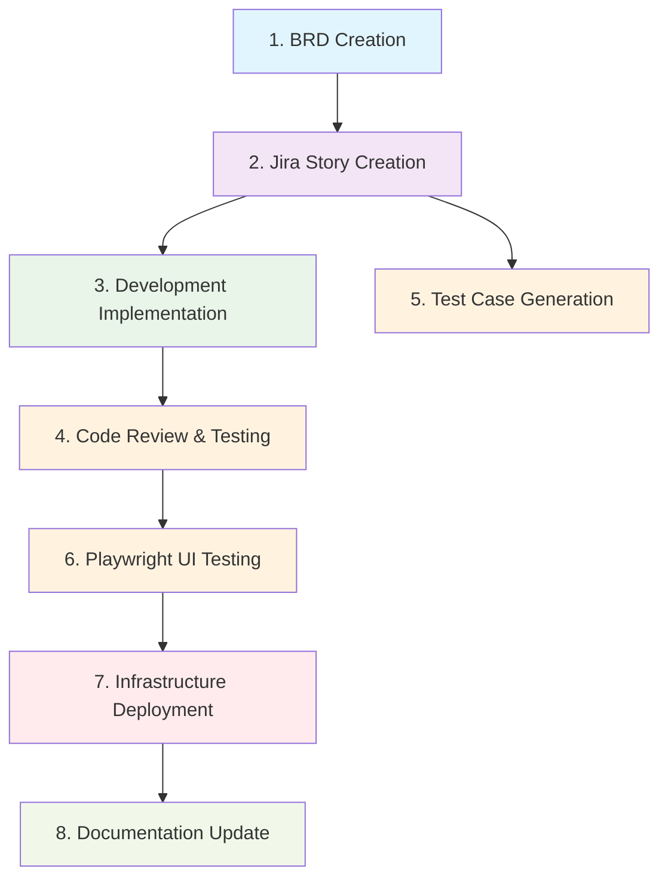

# SDLC Automation Prompt Framework

## Overview
This directory contains a comprehensive set of standardized prompts for automating the complete Software Development Life Cycle (SDLC) process, from business requirements to production deployment and documentation.

## SDLC Process Flow



## Prompt Structure Standards

All prompts follow a standardized format for consistency and automation:

```yaml
---
mode: agent|ask
sdlc_phase: requirement|development|testing|deployment|documentation
dependencies: [previous_phase_numbers]
---

# [Phase Number] - [Title]

## Overview
## Objectives
## Prerequisites
## Standards & Guidelines
## Workflow Steps
## Inputs
## Outputs
## Quality Gates
## Tools & Integrations
## Success Criteria
```

## Phase Descriptions

### Phase 1: Business Requirements Document Creation
- **Purpose:** Transform business use cases into structured BRD documents
- **Input:** Business use case description
- **Output:** Comprehensive BRD document (.docx)
- **Dependencies:** None

### Phase 2: Jira Story Creation from BRD
- **Purpose:** Decompose BRD into actionable development stories
- **Input:** BRD document, project key, epic number
- **Output:** Backend and frontend Jira stories with acceptance criteria
- **Dependencies:** Phase 1

### Phase 3: Development Implementation
- **Purpose:** Complete code implementation based on Jira stories
- **Input:** Jira story key
- **Output:** Feature branch with implemented code
- **Dependencies:** Phase 2

### Phase 4: Code Review and Testing
- **Purpose:** Review code quality and create comprehensive test suites
- **Input:** Jira story key, feature branch
- **Output:** Test cases, pull request to develop branch
- **Dependencies:** Phase 3

### Phase 5: Test Case Generation
- **Purpose:** Generate comprehensive test cases from acceptance criteria
- **Input:** Jira story key
- **Output:** Excel test case documentation
- **Dependencies:** Phase 2 (can run parallel with Phase 3)

### Phase 6: Playwright UI Testing
- **Purpose:** Generate and execute UI automation tests using MCP browser tools
- **Input:** Jira story key
- **Output:** Playwright test files and MCP execution results with visual evidence
- **Dependencies:** Phase 2 (can run parallel with Phase 4)

### Phase 7: Infrastructure Deployment
- **Purpose:** Deploy tested code to production using Terraform
- **Input:** Develop branch, Terraform configurations
- **Output:** Deployed infrastructure and running services
- **Dependencies:** Phase 4, Phase 6

### Phase 8: Documentation Review and Update
- **Purpose:** Update all project documentation to reflect changes
- **Input:** Jira story key, deployed system
- **Output:** Updated documentation files
- **Dependencies:** Phase 7

## Execution Guidelines

### Sequential Execution
For complete SDLC automation, execute prompts in numerical order:
1. Start with business requirements (Phase 1)
2. Follow dependency chain through deployment (Phase 7)
3. Complete with documentation update (Phase 8)

### Parallel Execution Opportunities
- **Phase 3 & 5:** Development and test case generation can run concurrently
- **Phase 4 & 6:** Code testing and UI test generation can overlap

### Input Requirements
Each prompt requires specific inputs defined in their respective files:
- **Dynamic Inputs:** Provided via chat prompts or parameters
- **Fallback Values:** Default values in prompt files when inputs not provided
- **MCP Integrations:** Automatic data fetching from external systems

## Quality Assurance

### Standards Compliance
- All prompts reference repository coding standards
- Frontend standards: `.github/instructions/frontend.instructions.md`
- Backend standards: `.github/instructions/backend.instructions.md`
- Repository-wide: `.github/copilot-instructions.md`

### Quality Gates
Each phase includes specific quality gates to ensure:
- Requirements traceability
- Code quality and security
- Test coverage and validation
- Deployment success
- Documentation accuracy

### Tool Integrations
- **Jira MCP:** Story management and requirement tracking
- **GitHub Integration:** Code repository and branch management
- **Playwright MCP:** UI automation testing
- **Terraform:** Infrastructure deployment automation
- **Documentation Tools:** File generation and management

## Usage Examples

### Complete SDLC Execution
```bash
# Execute each phase sequentially
prompt-1: "Create BRD for user authentication feature"
prompt-2: "Generate Jira stories from BRD with project key AUTH"
prompt-3: "Implement development for story AUTH-001"
prompt-4: "Review and test implementation for AUTH-001"
prompt-5: "Generate test cases for story AUTH-001"
prompt-6: "Create and execute Playwright tests for AUTH-001"
prompt-7: "Deploy latest develop branch with Terraform"
prompt-8: "Update documentation for story AUTH-001"
```

### Individual Phase Execution
```bash
# Execute specific phases as needed
prompt-6: "Execute Playwright tests for existing story GV-123"
prompt-7: "Deploy current develop branch"
prompt-8: "Update API documentation for recent changes"
```

## Best Practices

### Before Starting
1. Ensure all required tools and integrations are configured
2. Verify access permissions for repositories and external systems
3. Review and update repository standards as needed

### During Execution
1. Validate outputs from each phase before proceeding
2. Monitor quality gates and address any failures
3. Maintain traceability between phases and requirements

### After Completion
1. Verify end-to-end functionality in deployed environment
2. Update process documentation based on lessons learned
3. Archive artifacts and maintain version history

## Troubleshooting

### Common Issues
- **Missing Inputs:** Ensure all required parameters are provided
- **Permission Errors:** Verify access to repositories and external systems
- **Quality Gate Failures:** Address code quality or test failures before proceeding
- **Integration Failures:** Check MCP connections and API availability

### Support Resources
- Repository documentation in `docs/` directory
- Coding standards in `.github/instructions/`
- Issue tracking via repository issue system
- Team collaboration channels for technical support

---

This framework enables complete SDLC automation while maintaining high quality standards and comprehensive documentation throughout the development process.